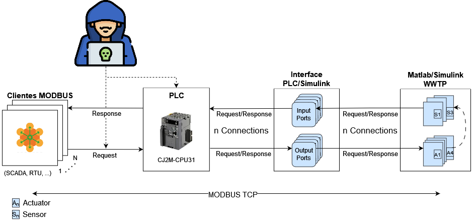
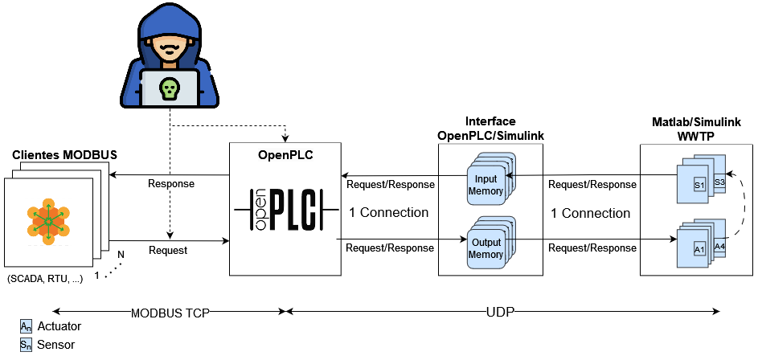

# Comparative study of latencies and performance of the Modbus protocol, on virtual and real PLCs using the Hardware in the Loop methodology

> **Note:** This repo is under development ⛏.

## Project Description

Device virtualization is a major focus of attention today. The open source project OpenPLC virtualizes Programmable Logic Controllers (PLCs) following the IEC 61131-3 standard. In the article "OpenPLC: An IEC 61,131-3 compliant open source industrial controller for cyber security research" a comparative study of the OpenPLC project with real PLCs in terms of its functionality was carried out, with satisfactory results. However, there is currently no comparative study considering exclusively network parameters such as throughput and latency. Precisely this Final Degree Project (PFG) aims to focus on this analysis. To develop the tests both on OpenPLC and on real PLCs, the "Hardware in the Loop" methodology will be used, which will be carried out by simulating a process in Matlab Simulink which will be connected to the inputs and outputs of the PLCs. Additionally, Modbus clients deployed on the docker tool will be used to perform the connection tests on the PLCs.

## General Architecture

| Architecture containing Real PLC  |  Architecture containing OpenPLC |
|---|---|
| |  |

- Architecture components/procedures:

  1. Clients to evaluate performance
  2. PLC: OpenPLC, RealPLC
  3. Interface: OpenPLC, RealPLC
  4. Hardware In the Loop (HIL) based on WWTP
  5. Security analysis

## Documentation

1. [Background of components](https://docs.google.com/document/d/15xwSIb0y4NIzIaMRUIs0t0eJ-V2CuZkw/edit?usp=sharing&ouid=112081455839953688829&rtpof=true&sd=true)
   1. [Hardware PLC module configuration guide](https://docs.google.com/document/d/1xB3YLqI5UiYcW1s1Sb0ApSWaoBoxyXvQtbazRlI4LEY/edit?usp=sharing)
   2. [Software PLC module configuration guide](./real_plc/Como_Conectar_a_CX.pdf)
   3. [Integration with Hardware In The Loop stage](./hwintheloop/Resumen_del_Proyecto_Hardware_in_the_Loop.pdf)
2. [Real PLC and OpenPLC architecture design and experiment design](https://docs.google.com/document/d/16R5RU5ItskVm6NDPMELxj9diJbljJUccMOeNoo6CXrY/edit?usp=sharing)
3. [Real PLC and OpenPLC architecture implementation](https://docs.google.com/document/d/10oSrLKRrvdAGgbvsW2g0rURjR7ssxkvX5nWHqeNMi0o/edit?usp=sharing)
   1. Real PLC interface: [document](./real_plc/interface/Research_Final_Paper.pdf), [sildes](./real_plc/interface/Research_Final_Presentation.pdf)
4. [Results] Coming soon
   1. Interface designed for OpenPLC
   2. Interface designed for RealPLC
5. Security Analysis
   1. [Omron Exploit list(PLC CJM2-CPU31/CX-Programmer)](./exploits/Exploits.md)
   2. [Detailed Exploit Documentation](./exploits/Documentacion_exploits.pdf)

## To Do

1. Integrate GNS3 server with current virtualized infrastructure.
