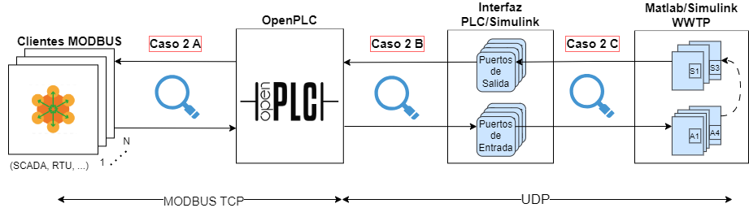

# OPENPLC PERFORMANCE METRICS

## Measures the performance of the openplc network by focusing on vertical scalability by increasing the number of clients and and simulating their operability in a critical infrastructure such as a WWTP.

**CLIENT** <--Modbus TCP--> **OPENPLC** <--UDP--> **INTERFACE** <--UDP--> **WWTP**

